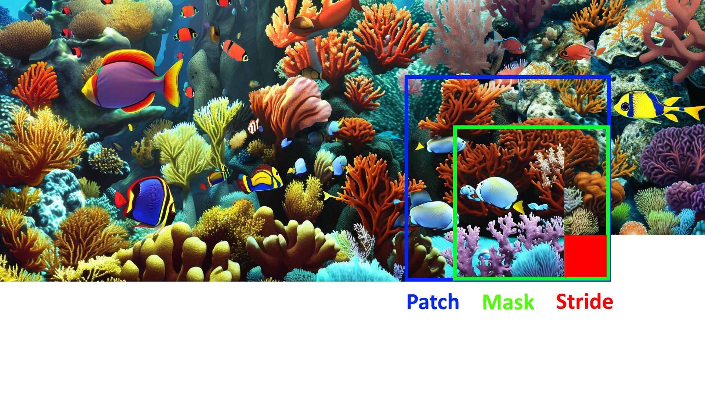

# T-shirt-print
A simple utility on top of stable diffusion pipeline from Huggingface allowing to obtain images of unlimited size

## Motivation
Stable Diffusion and its ancestors provides a simple way to
create beautiful images out of a textual description. 
However, the size of such images are limited mostly by
512 x 512 (or 1024 x 1024) pixel, which is good enough 
for an illustration, but too small to serve, for example,
as a T-shirt print.

This simple projects aims to overcome this limitation. 
The idea is to use moving area of size 512 x 512 running
across the full sized image with some overlap and 
complement the unfilled areas using inpainting. 

The drawback of such approach is the full sized image
might lack the overall subject, but the result is still
goog enough to be used a T-shirt print, 
wallpaper print, etc.

## Method

### Moving patch

With the default configuration, the full sized image is being created
path by patch while moving from left to right and line by line from
top to bottom. After the current patch is created, the slicing patch
window is moved to 128 pixels to the right, or at the beginning of
the next line, which is 128 pixels lower. The new mask has an overlap
with existing part of new patch, default overlap is 256 pixels to the
left and 256 pixels to the top. Then the joined overlapped area and empty area are inpainted, and 
slicing widow is being moved again.

Schematically all areas of this process is shown on the picture:

### Upscale

It might take a lot of time to create a full size image for the resolution
T-shirt or higher. Also, details might be of relatively small size.
To mitigate these drawbacks, one can decide to first create 
an image of smaller size, and then upscale it. 

The [Real-ESRGAN](https://github.com/ai-forever/Real-ESRGAN) is used for
the upscale purpose. Available upscale factors are 2, 4, and 8. Model is downloaded
when called for the first time and stored in local `realesrgan` folder.

## Setup

1. Install Python 3.11 (might also work for lower versions, but not tested)
2. Install all requirements with `pip install -r requirements.txt`
3. Sign up (if not yet) to https://huggingface.co/
4. Obtain huggingface access token as described in https://huggingface.co/docs/hub/security-tokens
5. run `python t-shirt-print/print.py -t <huggingface access token> -r T-shirt -u 2 -p "MC Escher drawing"`
6. enjoy

## Parameters

The following parameters are available:

- `-p`, `--prompt` the prompt
- `-np`, `--negavive-prompt` negative prompt, default value
is tuned to avoid frames, boundaries, watermarks, and other 
add artefacts and to ensure a seamless stitching
- `-r`, `--resolution` image resolution, one of 
  - `SVGA` 800 x 600
  - `WSVGA` 1024 x 600
  - `XGA` 1024 x 768
  - `HD` 1280 x 720
  - `WXGA` 1280 x 768
  - `SXGA` 1280 x 1024
  - `Full HD` 1920 x 1080
  - `Ultra HD` 3840 x 2160
  - `4K UHD` 4096 x 2160
  - `T-shirt` 4800 x 3301
- `-s`, `--shape` any other custom resolution is also available
using this parameter, for example `-s <width> <height>`
- `-a`, `--artist` way to fill the full size image, default value is `top-to-bottom`,
the following artists are available:
  - `top-to-bottom`
  - `left-to-right`
- `-mi`, `--model-id` Hugging Face model id, the default is
[stabilityai/stable-diffusion-2-inpainting](https://huggingface.co/stabilityai/stable-diffusion-2-inpainting)
any other model with the same architecture can be used, however, 
if a model was not explicitly trained for inpainting task,
it can produce boundary artifacts. Another good model is 
[runwayml/stable-diffusion-inpainting](https://huggingface.co/runwayml/stable-diffusion-inpainting)
- `-mt`, `--model-type` Model type, the default is `stable-diffusion`, 
following model types are supported
  - `stable-diffusion`
  - `stable-diffusion-xl`
- `-ms`, `--mask-stride` the stride of the inpainting mask
- `-mo`, `--mask-overlap` the overlap of inpainting masks
- `-nis`, `--num-inference-steps` the number of inference steps
for each patch, the bigger is this number, the better is quality
but longer the image creation
- `-gs`, `--guidance-scale` diffusion parameter
- `-is`, `--inpainting-strength` diffusion parameter, 
it is better to keep the default value, 1
- `-u`, `--upscale` the upscale factor, optional, can be 2, 4, or 8
- `-t`, `--token` the Hugging Face access token, the value
can be assigned to environment variable `HUGGINGFACE_AUTH_TOKEN`,
in this case this parameter is optional
- `-cf`, `--cache-folder` Hugging Face cache folder, optional,
the value can be assigned to environment variable `HUGGINGFACE_HUB_CACHE`,
otherwise all models will be stored to local `huggingface` folder
- `-pf` ,`--print-folder` Folder to store created prints, default is `prints`